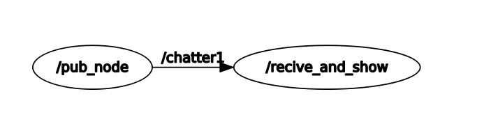
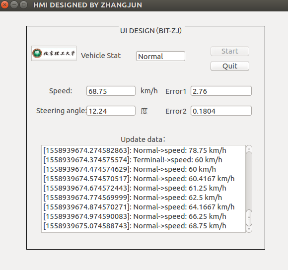

# UI_based_on_ros

We have designed a data UI based on ROS (c++), which can facilitate data display and human-machine interaction, such as unmanned driving test scenarios.


ROS node /pub_node publishes message such as speed to topic /chatter, while ROS node /receive_and_show receives these messages and show in our desiged UI.

## rqt_graph
 


## UI 
 

## usage

### compile
Clone the code
```
git clone https://github.com/zj611/UI_based_on_ros.git
```
Then copy the package to your ROS workspace,such as catkin_ws/src, the compile the project 
```
cd catkin_ws
catkin_make 

```

### run the project
Open 3 terminal and run the following cammands
1.
```
roscore

```

2.
```
rosrun show_msg pub1

```

3.
```
rosrun show_msg msg

```


